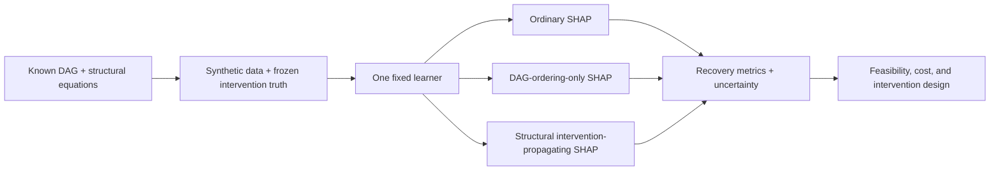
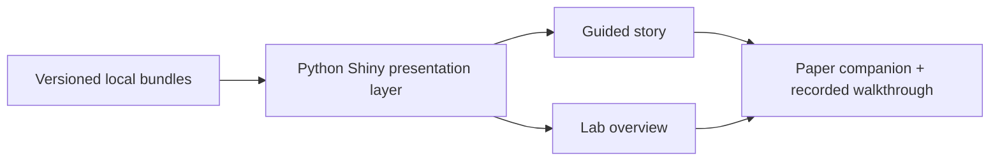

# Guided Demo and Video Guide

The companion app is designed for a reproducible seven-to-nine-minute paper
walkthrough. It uses checked-in assets rather than live attribution calls.

## Guided story versus Lab overview

| Experience | Purpose | Interaction |
| --- | --- | --- |
| Guided story | Reader/video mode that controls narrative order and prevents later results from appearing early. | Six explicit steps with Previous/Next navigation. |
| Lab overview | Audit and orientation mode that exposes the scientific estimands, current evidence status, and app architecture together. | Switch datasets to compare the NASA primary analysis with the labeled teaching stress test. |

Lab overview is not a live model-fitting environment. Both experiences read the
same versioned, precomputed bundles; the difference is sequencing versus
simultaneous inspection.

## Scientific concept schematic

## Tool/demo schematic

## Story arc

1. **Mission and estimand:** prediction importance is not automatically an
   intervention ranking.
2. **Signal ceiling:** reveal XGBoost AUC 0.684 beside oracle AUC 0.701.
3. **Living DAG:** show where the 28 prediction features sit relative to the
   nephrolithiasis outcome.
4. **Fair falsification:** compare matched ordinary and DAG-ordering-only SHAP;
   retain the null result.
5. **Structural prototype:** show how intervention propagation redistributes
   importance toward the frozen total-effect truth.
6. **Decision boundary:** explain that attribution is only an input to feasible,
   safe, cost-aware intervention design.

The pedagogic mediator/proxy bundle can be shown first as an intuitive failure
case, provided the “designed stress test—not NASA evidence” label remains visible.

## Recording assets still needed

- wrong-lever opening graphic;
- DAG-to-equations-to-data pipeline graphic;
- compact paired-bootstrap interval plot;
- intervention-propagation animation;
- final citation/QR end card after a stable deployment URL exists.
