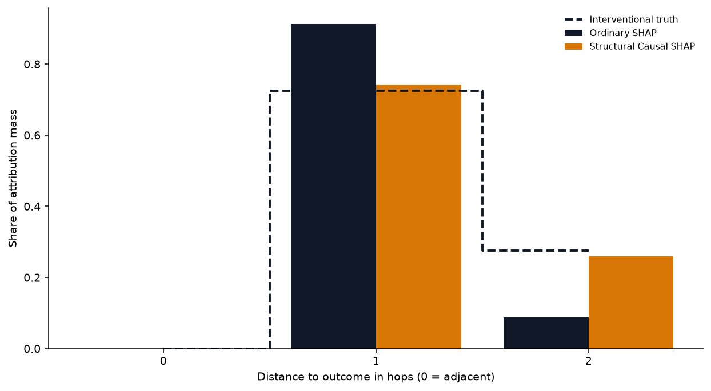

[Setup.]{.lead-in} A fitted prediction model and a background dataset. No causal
structure yet — exactly the situation most explainability tooling assumes.

[Move.]{.lead-in} Compute ordinary (interventional) SHAP importances and rank
the features.

## The homunculus

When we draw the DAG with each node sized by its ordinary-SHAP share, the graph
distorts: nodes near the outcome balloon, distal causes shrink. The collider
`ClinicVisit` — predictive but with **zero** total effect — becomes the largest
node.

The same pattern, quantified: attribution mass piles up at small hop-distances to
the outcome.

## Failure by construction vs the honest flagship

On the designed teaching and ACIC data the failure is stark — the proxies are
*built* to be predictive-yet-inert:

[Caveat.]{.lead-in} On the source-exact **NASA** problem the failure is not
theatrical. Ordinary SHAP (Kendall τ ≈ 0.52) and DAG-*ordering* SHAP (τ ≈ 0.53)
are statistically tied — a deliberate null result. Re-ordering coalitions is not
enough; you need to *propagate interventions* ([rung 3](03-causal-shap.qmd)).

::: {.pullquote}
"Prediction sees features; the causal question sees positions." Ordinary SHAP is
answering a prediction question, faithfully. The problem is the question.
:::

Next: [learn the structure you were missing →](01-causal-discovery.qmd)
