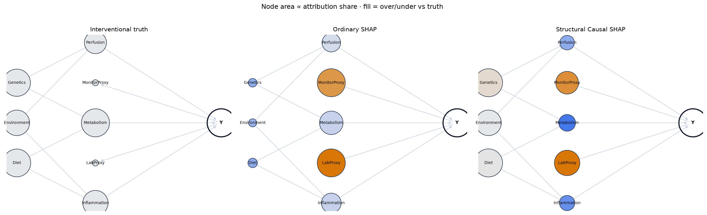
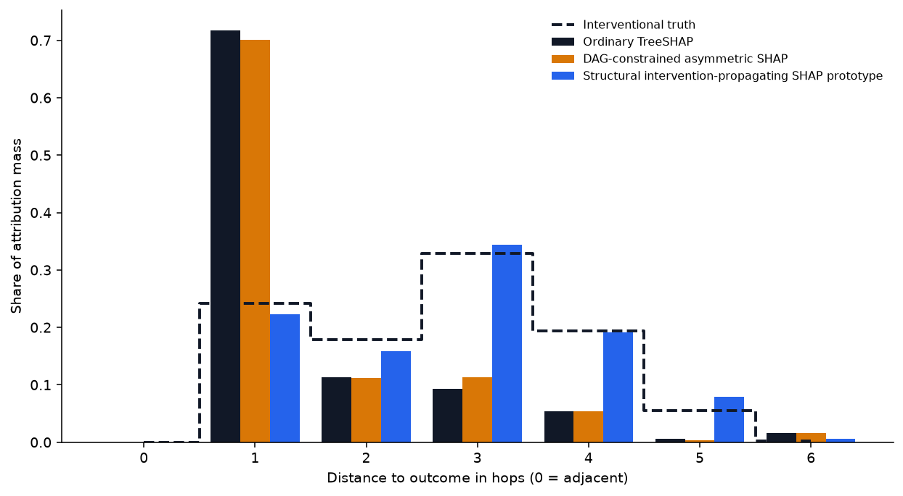

[Setup.]{.lead-in} A structural model of the DAG (mechanisms, not just edges) and
a fitted prediction model to explain.

[Move.]{.lead-in} Replace the value function. Instead of conditioning on
observed features, **intervene** and propagate: the coalition value is
$$ v(S) = \mathbb{E}\big[\, f(X) \mid do(X_S = x_S) \,\big], $$
computed by abducting exogenous noise from a background row, applying
$do(X_S = x_S)$, propagating through descendants, and scoring the model. Averaging
marginal contributions over DAG-consistent orderings gives structural Causal SHAP.

## Why it moves credit upstream

When you intervene on an upstream cause, its effect flows through mediators to the
outcome, so it collects the credit its descendants used to hoard. The proxy, a
sink, keeps only its own direct pull on the model.

On the toy DAG this flips the ranking from *anti-correlated* with truth to
*positively* correlated:

| Method | Kendall τ vs truth |
|---|---|
| Ordinary SHAP | −0.33 |
| Structural Causal SHAP | +0.33 |

## The flagship, told straight

On NASA the structural prototype is the *only* method that closes the gap to the
frozen interventional truth:

| Metric | Value |
|---|---|
| Kendall τ (structural vs truth) | 0.794 |
| Top-5 target recovery | 100% |
| Proximity Bias Index | −0.113 (near zero) |

::: {.provisional}
The NASA structural result is a **prototype** (32 evaluation records × 32
backgrounds × 32 permutations). It must be scaled and bootstrapped before it
carries a manuscript claim.
:::

[Caveat.]{.lead-in} Structural attribution is only as good as the structural
model. A wrong mechanism gives confident, wrong credit — which is why the next
rung stress-tests everything against known truth.

Next: [validate where the answers are known →](04-validation.qmd)
