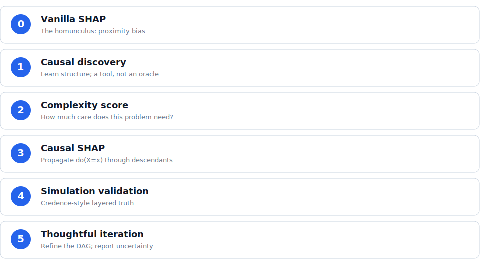

The ladder is a decision path, not a fixed recipe. You climb only as far as the
problem demands — and the [complexity score](02-complexity-score.qmd) helps you
decide how far that is.

{.ladder-hero}

## How to read each rung

Every rung page follows the same shape:

- **[Setup]{.lead-in}** — what the rung assumes you already have.
- **[Move]{.lead-in}** — the one thing this rung does.
- **[Evidence]{.lead-in}** — the figure or numbers from the frozen pipeline.
- **[Caveat]{.lead-in}** — where the rung can mislead you.

## Two honest stories

The ladder is demonstrated on two kinds of data, and they tell different truths:

| Data | What it shows |
|---|---|
| **Teaching / ACIC** | Failure *by construction*: zero-effect proxies get large ordinary-SHAP mass. The homunculus is dramatic. |
| **NASA flagship** | The honest case: ordinary and DAG-*ordering* SHAP are statistically tied. Only intervention *propagation* (rung 3) moves the numbers. |

::: {.pullquote}
Rungs 1 and 2 do not, by themselves, change the attribution. They build the
causal model and tell you how much to trust it. The numbers move at rung 3.
:::

Start at [rung 0 →](00-vanilla-shap.qmd)
